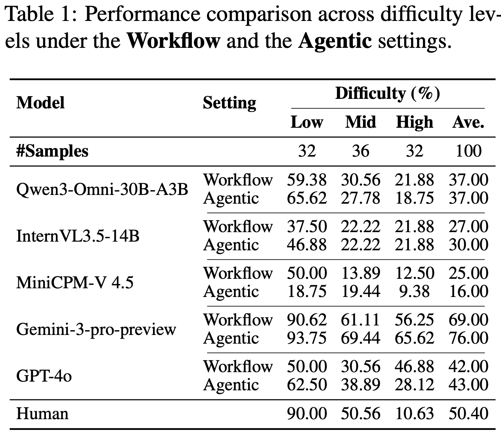
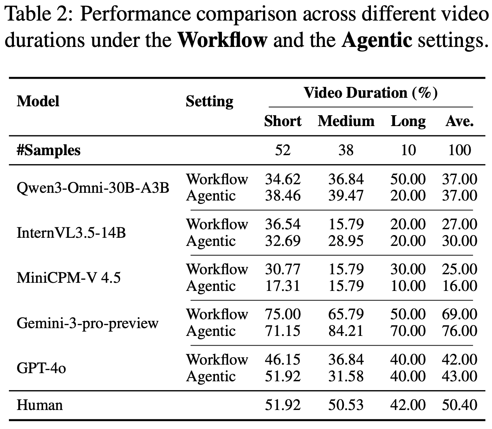
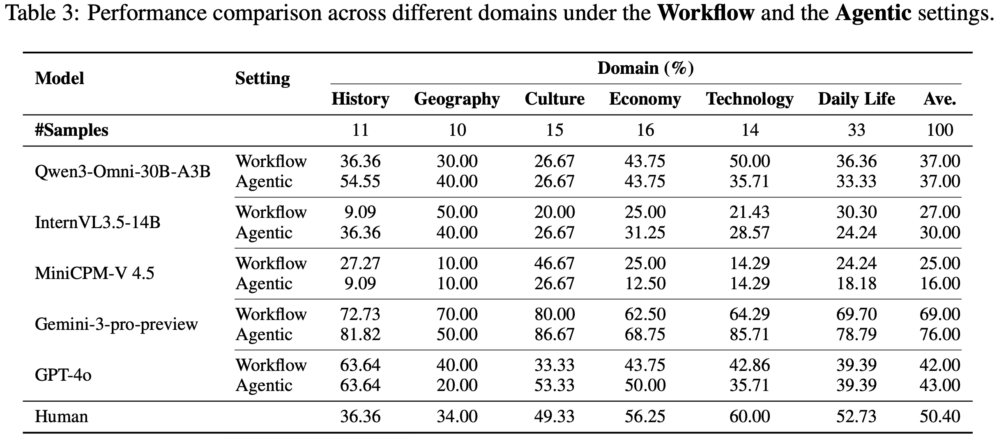
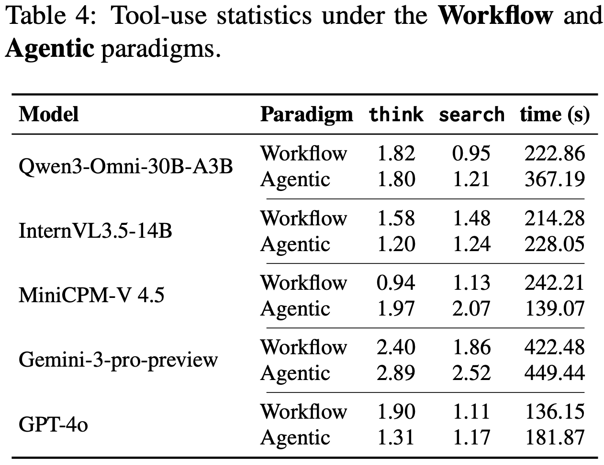
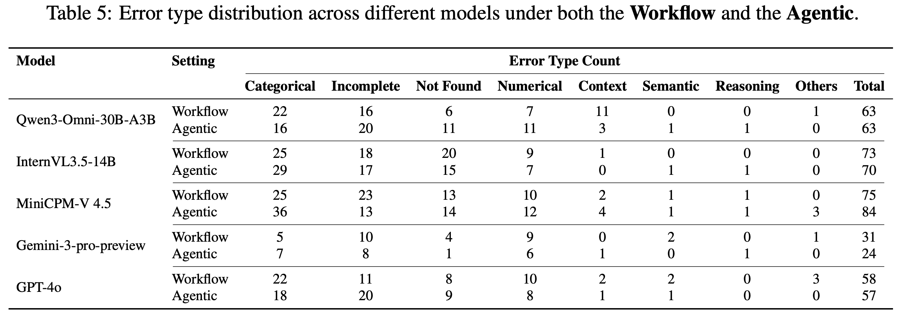

# Watching, Reasoning and Searching: A Video Deep Research Benchmark on Open Web for Agentic Video Reasoning


<p align="center">
    
</p>

<font size=7><div align='center' > [[📖 Paper]()] [[📊 Dataset]()] </div></font>

---

## 🔥 News
* **`2026.01.11`** 🌟 We are very proud to launch VideoDR, the first-ever video deep research benchmark in Video Domain!


## 👀 VideoDR Overview

In real-world video question answering scenarios, videos often provide only localized visual cues, while verifiable answers are distributed across the open web; models therefore need to jointly perform cross-frame clue extraction, iterative retrieval, and multi-hop reasoning-based verification. To bridge this gap, we construct the first video deep research benchmark, VideoDR. VideoDR centers on video-conditioned open-domain video question answering, requiring cross-frame visual anchor extraction, interactive web retrieval, and multi-hop reasoning over joint video–web evidence; through rigorous human annotation and quality control, we obtain high-quality video deep research samples spanning six semantic domains. We evaluate multiple closed-source and open-source multimodal large language models under both the Workflow and Agentic paradigms, and the results show that Agentic is not consistently superior to Workflow: its gains depend on a model’s ability to maintain the initial video anchors over long retrieval chains. Further analysis indicates that goal drift and long-horizon consistency are the core bottlenecks. In sum, VideoDR provides a systematic benchmark for studying video agents in open-web settings and reveals the key challenges for next-generation video deep research agents.


<p align="center">
    
</p>

## 🔮 Evaluation Pipeline
## 🔮 Evaluation Pipeline

📍 **Extract Frames and Subtitles**: Sample key frames across the video timeline and extract subtitles (if any) to enable cross-frame visual and textual input for MLLMs.

📍 **Input Preparation**: Provide video frames/subtitles and question Q to the model under Workflow (two-stage: cue extraction first) or Agentic (end-to-end) paradigm.

📍 **Cue Extraction (Workflow Only)**: Use MLLM to identify and structure question-relevant multi-frame visual anchors as intermediate text.

📍 **Iterative Retrieval**: Generate search queries based on video cues, call browser search tool S to fetch web evidence iteratively.

📍 **Multi-Hop Reasoning**: Reflect with think tool, integrate video anchors and web evidence to verify facts and resolve the query.

📍 **Output Answer**: Produce unique factual answer A grounded in joint evidence.

📍 **Evaluation**: Use LLM-as-judge (e.g., DeepSeek-V3) to score semantic equivalence to gold answer, compute accuracy across difficulty, duration, and domain strata.

## 📈 Experimental Results

Table 1 compares the performance of various models under Workflow and Agentic settings across different difficulty levels, showing a general decline in accuracy as difficulty increases.

<p align="center">
    
</p>

Table 2 compares the performance of models under Workflow and Agentic settings across short, medium, and long video durations, highlighting how longer videos amplify differences between paradigms.

<p align="center">
    
</p>

Table 3 compares model performance under Workflow and Agentic settings across semantic domains like History, Geography, and Technology, revealing domain-specific advantages of each paradigm.

<p align="center">
    
</p>

Table 4 presents tool-use statistics for think and search calls along with runtime under Workflow and Agentic paradigms, indicating no direct correlation between tool usage and accuracy.

<p align="center">
    
</p>

Table 5 distributes error types across models in both Workflow and Agentic settings, identifying Categorical Error as the dominant failure mode and Numerical Error as a persistent weakness.

<p align="center">
    
</p>

## 🔧 Failure Analysis Tool

We provide an LLM-based failure analysis tool (`llm_as_judge`) to automatically classify failure cases into different error categories based on trace analysis.

### Installation

```bash
cd llm_as_judge
pip install -r requirements.txt
```

### Configuration

Create a `.env` file in the `llm_as_judge` directory with your LLM API credentials:

```bash
LLM_BASE_URL=your_api_base_url
LLM_API_KEY=your_api_key
```

### Usage

```bash
# Analyze all models
python llm_as_judge/src/analyze_failure_types.py \
    --excel_file llm_as_judge/data/Video-LLM.xlsx \
    --trace_dir results/traces \
    --max_workers 4

# Analyze specific models
python llm_as_judge/src/analyze_failure_types.py \
    --excel_file llm_as_judge/data/Video-LLM.xlsx \
    --trace_dir results/traces \
    --models gpt52 gpt4o \
    --max_workers 4
```

**Key Parameters:**
- `--excel_file`: Evaluation Excel file (default: `Video-LLM.xlsx`)
- `--trace_dir`: Directory with trace JSON files (default: `traces`)
- `--models`: Model keys to analyze: `qwen`, `internvl`, `minicpm`, `gpt4o`, `gemini`, `gpt52` (default: all)
- `--max_workers`: Concurrent workers (default: 4)